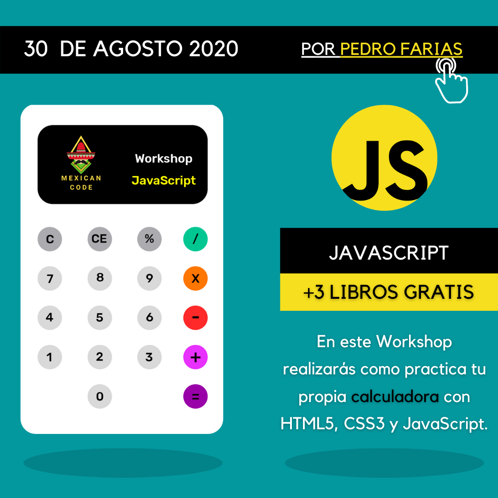

# **WorkShop JS** 👨‍💻

## Calculadora JS

> Esta workshop fue gracias a **Latin Code**

### 📎 Descripción

Está es una aplicación creada con el fin de dar una introducción a **JS** y poder ayudar a los principiantes a conocer el lenguaje. La lógica es muy simple con el mínimo de líneas de código posibles

### 📎 Temas a resolver en la aplicación

[ ] Crear los archivos a utilizar

[ ] Crear la estructura html

[ ] Referenciar los archivos y funtes externas

[ ] Crear el input( pantalla de la calculadora )

[ ] Estilos de la aplicacion y herramientas para utilizar

### 📎 Capetas dentro de la aplicacion

* pages:
    - index.html
* css:
    - style.css
* js:
    - app.js

### 📎 Pasos para ejecutar la Calculadora

1. Descargar el codigo completo
2. Abra el archivo **idex.html** que esta dentro de la carpeta **pages**